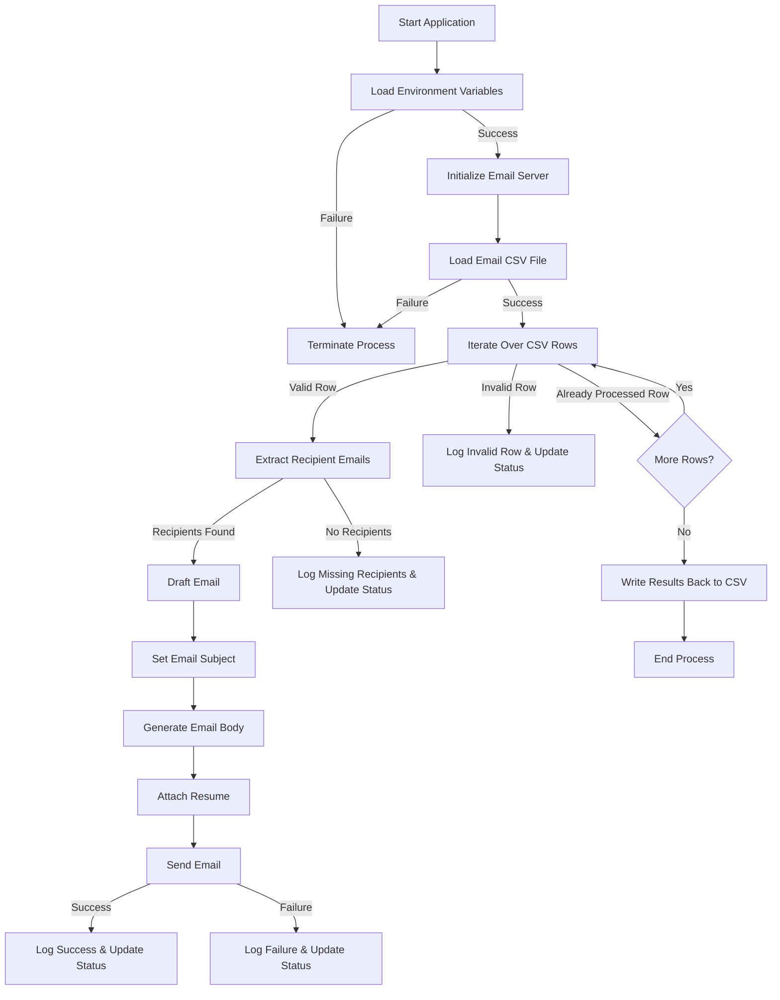

# Mass Email Sender

This Java-based application is for sending emails with an attached resume to multiple recipients across various
companies. You can provide a list of emails as a CSV file, and according to the sender's email and the rest of the
details you provide an automatic email will be sent to receivers. This program is containerized using Docker for ease of
deployment.

A generated email might look like this:

**Subject:** Application for Software Engineering Internship at Google

**Body:**

```text
Dear Sir/Madam,

I hope this message finds you well. My name is Sundar Pichai, and I am currently a third-year undergraduate studying 
Computer Science at the University of Colombo School of Computing. I am writing to express my keen interest in securing a 
Software Engineering internship position at Google.

...

I have attached my resume for your review and am available for an interview at your earliest convenience. Thank
you for considering my application. I look forward to the possibility of joining Google as a Software Engineering
intern and contributing to your team's success.

Best regards,
Buddhika Senanayake.
+94 71 234 5678
bnsbuddhika@gmail.com
https://www.linkedin.com/in/buddhikanip/
```

**Attachment:** [resume.pdf](src/main/resources/resume.pdf)

All the above content can be customized according to your own will.

## Project Structure

```bash
.
├── Dockerfile
├── README.md
├── docker-compose.yml
├── pom.xml
└── src
    ├── main
    │   ├── java
    │   │   └── com
    │   │       └── email
    │   │           ├── EmailServer.java
    │   │           ├── Mail.java
    │   │           ├── Main.java
    │   │           └── User.java
    │   └── resources
    │       ├── Emails.csv
    │       ├── email_body.txt
    │       └── resume.pdf
    └── test
        └── java
```

## Workflow



## How to Run

### Prerequisites

- Java 17 (or higher)
- Docker and Docker Compose (Optional)

### Steps

1. **Clone the Repository**

   ```bash
   git clone https://github.com/Buddhikanip/Email-Sender.git
   cd Email-Sender
   ```

2. **Build and Run with Docker**

    - Build and Run Docker image:
      ```bash
      docker-compose up --build
      ```

3. **Run Without Docker**

    - Compile the project:
      ```bash
      mvn clean install
      ```
    - Execute the application:
      ```bash
      java -jar target/<your-jar-file>.jar
      ```

4. **Check Logs**
   Monitor the logs to ensure emails are being sent:

   ```bash
   docker logs <container-id>
   ```

## Key Files

- **[Emails.csv](src/main/resources/Emails.csv)**: Contains the recipient details and sending status.

  | Status  | Company | Recipient 1                  | Recipient 2                 | Recipient 3             |
  |---------|---------|------------------------------|-----------------------------|-------------------------|
  | Sent    | Google  | sundar.pichai@gmail.com      | walter.white@gmail.com      | jesse.pinkman@gmail.com |
  | Failed  | Netflix | michael.scofield@netflix.com | lincoln.burrows@netflix.com |
  | Pending | Apple   | steve.jobs@apple.com         |

    - First column: `status`
      > Initially you can keep it empty. The program will append the status of the email to that column.
    - Second column: `company name`
    - Third column onwards
      > Receiving emails under the specified company. One cell can contain only one email. If there's a second or third
      email for the same company, you can put them in the 4th column onwards

- **[email\_body.txt](src/main/resources/email_body.txt)**: A customizable template as text file containing email body.

  ```text
  Dear Sir/Madam,

  I hope this message finds you well. My name is {name}, and I am currently a third-year undergraduate studying 
  Computer Science at the University of Colombo School of Computing. I am writing to express my keen interest in 
  securing a Software Engineering internship position at {company}.
  
  ...
  
  I have attached my resume for your review and am available for an interview at your earliest convenience. Thank
  you for considering my application. I look forward to the possibility of joining {company} as a Software Engineering
  intern and contributing to your team's success.

  Best regards,
  {name}.
  {phone}
  {email}
  {linkedIn}
  ```

- **[resume.pdf](src/main/resources/resume.pdf)**: Your resume file.
- **[.env.example](.env.example)**: Example .env file.
    ```dotenv
    # Email server settings
    EMAIL_USERNAME=example@gmail.com
    EMAIL_PASSWORD=your-email-app-password
    EMAIL_HOST=smtp.gmail.com
    EMAIL_PORT=587
    
    # Email content
    EMAIL_SUBJECT=Application for Software Engineering Internship at {company}
    EMAIL_BODY=email_body.txt
    
    # Personal details for the cover letter
    NAME=Buddhika Senanayake
    PHONE=+94 71 234 5678
    EMAIL=bnsbuddhika@gmail.com
    LINKEDIN=https://www.linkedin.com/in/buddhikanip/
    
    # Resume file
    RESUME=resume.pdf
    ```

  You can set a `.env` in the root directory and customize your details.\
  `EMAIL_USERNAME`: Your email address (send address)\
  `EMAIL_PASSWORD`: If you are using Gmail this is a 16-digit passcode that allows a third-party app or device to access
  your Google Account. (Not your Gmail password)
  [For reference](https://knowledge.workspace.google.com/kb/how-to-create-app-passwords-000009237)

  If you are using some other email service your email server access password.

    - Copy the `.env.example` file to create your `.env` file:
        ```bash
        cp .env.example .env
        ```

## Customization

How the code can be customized

- **[Emails.csv](src/main/resources/Emails.csv)**: Contains the recipient details and sending status.
  > Same as [above](README.md#key-files), put your receptions list and according to company.
  first column must be empty contain value without `Sent` program contain below logic if you want to customize your
  own. ([Main.java](src/main/java/com/email/Main.java) line 49-54)
    ```java
    String status = row[0];
    if ("Sent".equalsIgnoreCase(status)) {
      log.info("Skipping already processed row: {}", Arrays.toString(row));
      updatedData.add(row);
      continue;
    }
    ```

- Email Subject:
  > Email subject is fetch from `.env` file (line 8). You can customize it according your requirement. It's `{company}`
  placeholder is replaced with company name in `Emails.csv` if you don't want company name simply remove that
  placeholder. (This will work but is not recommended)
    ```dotenv
    EMAIL_SUBJECT=Application for Software Engineering Internship at {company}
    ```
    - Recommended way
        1. Remove `{company} placeholder like above`
        2. Update [Mail.java](src/main/java/com/email/Mail.java) `draftEmail` function first line as below
            ```java
            String subject = user.emailSubject();
            ```

- **[email\_body.txt](src/main/resources/email_body.txt)**: A customizable template as text file containing email body.
  > `{comapny}` in `email_body.txt` are replaced by `Emails.csv` second column values. These values are assign in the
  runtime. In the `email_body.txt` put `{company}` where you want to replace company name.

  > Also `{name}` `{phone}` `{email}` `{linkedIn}` values assign on
  runtime. ([Mail.java](src/main/java/com/email/Mail.java) `line 44-49`)
    ```java
    // Replace placeholders with actual values
    String body = bodyTemplate.replace("{name}", user.name())
            .replace("{company}", company)
            .replace("{phone}", user.phone())
            .replace("{email}", user.email())
            .replace("{linkedIn}", user.linkedIn());
    ```
  > Above `{name}` `{phone}` `{email}` `{linkedIn}` values are fetch from your `.env` file. If you don't want these
  values as environment variables you can simply hardcoded these values in your `email_body.txt`. Then you can remove
  those variables form your `.env` , `Main.java` , `User.java` and `Mail.java` files.

    - If you want to remove them follow these steps.
        1. Remove .env below lines. (`line 11-15`)
            ```dotenv
            # Personal details for the cover letter
            NAME=Buddhika Senanayake
            PHONE=+94 71 234 5678
            EMAIL=bnsbuddhika@gmail.com
            LINKEDIN=https://www.linkedin.com/in/buddhikanip/
            ```

        2. Update [Main.java](src/main/java/com/email/Main.java) `line 34` as below.
            ```java
            User user = new User(emailSubject, emailBody, resume);
            ```

        3. Remove [Main.java](src/main/java/com/email/Main.java) below lines. (`line 24-27`)
            ```java
            private static final String name = getEnv("NAME");
            private static final String phone = getEnv("PHONE");
            private static final String email = getEnv("EMAIL");
            private static final String linkedIn = getEnv("LINKEDIN");
            ```

        4. Update Mail.java `line 44-49` as below
           ```java
           // Replace placeholders with actual values
           String body = bodyTemplate.replace("{company}", company);
           ```

        6. Update User.java `line 3-5` as below
           ```java
           public record User(String emailSubject, String emailBody, String resume) {}
           ```

  Likewise, you can remove placeholder values. If you want to add new values add your new field for every file in
  above steps.


- Send Email without Attachments
    1. Have to Update [Mail.java](src/main/java/com/email/Mail.java) file `draftEmail` function. Follow below steps.
        1. Remove these code section in `draftEmail` function.
            ```java
            MimeBodyPart bodyPart = new MimeBodyPart();
            bodyPart.setText(body, "utf-8");
      
            MimeBodyPart attachmentPart = new MimeBodyPart();
            String attachmentPath = String.format("src/main/resources/%s", user.resume()); // Local path
            File resumeFile = new File(attachmentPath);
            if (!resumeFile.exists()) {
                attachmentPath = String.format("/app/resources/%s", user.resume()); // Docker path
            }
            attachmentPart.attachFile(attachmentPath);
      
            MimeMultipart multipart = new MimeMultipart();
            multipart.addBodyPart(bodyPart);
            multipart.addBodyPart(attachmentPart);
            mimeMessage.setContent(multipart);
            ```

        2. Paste this code line to deleted section.
           ```java
           mimeMessage.setText(body, "utf-8");
           ```

        3. Final `draftEmail` function must be look like this.
           ```java
           public void draftEmail(String recipient, String company, User user) throws MessagingException, IOException {
              String subject = user.emailSubject().replace("{company}", company);
               
              // Read the cover letter
              String templatePath = String.format("src/main/resources/%s", user.emailBody()); // Local path
              if (!new File(templatePath).exists()) {
                  templatePath = String.format("/app/resources/%s", user.emailBody()); // Docker path
              }
              String bodyTemplate = Files.readString(Paths.get(templatePath));
               
              // Replace placeholders with actual values
              String body = bodyTemplate.replace("{name}", user.name())
                  .replace("{company}", company)
                  .replace("{phone}", user.phone())
                  .replace("{email}", user.email())
                  .replace("{linkedIn}", user.linkedIn());
               
              mimeMessage = new MimeMessage(newSession);
              mimeMessage.addRecipient(Message.RecipientType.TO, new InternetAddress(recipient));
              mimeMessage.setSubject(subject);
              mimeMessage.setText(body, "utf-8");
           }
           ```
    2. Remove below line in `.env` file.
        ```dotenv
        # Resume file
        RESUME=resume.pdf
        ```

    3. Update [Main.java](src/main/java/com/email/Main.java) file as below.
        1. Remove below code line.
            ```java
            private static final String resume = getEnv("RESUME");
            ```

        2. Update below code line. (Remove `resume` in constructor)
           ```java
           User user = new User(name, phone, email, linkedIn, emailSubject, emailBody);
           ```

    4. Update [User.java](src/main/java/com/email/User.java) file like below. (Remove `String resume` in constructor)
        ```java
        public record User(String name, String phone, String email, String linkedIn, String emailSubject, String emailBody) {}
        ```

- Send multiple attachments
    1. Update [Mail.java](src/main/java/com/email/Mail.java) file `draftEmail` function file attachment part as below.
       > This example files names are hardcoded in array list if you want get them via `.env` you can add these file
       names as an array and fetch them in `Main.csv` and so on.
       ```java
       List<String> attachments = Arrays.asList("resume.pdf","portfolio.pdf");
       
       MimeMultipart multipart = new MimeMultipart();
       multipart.addBodyPart(bodyPart);
       
       for (String attachment : attachments) {
           MimeBodyPart attachmentPart = new MimeBodyPart();
           String attachmentPath = String.format("src/main/resources/%s", attachment); // Local path
       
           File file = new File(attachmentPath);
           if (!file.exists()) {
                attachmentPath = String.format("/app/resources/%s", attachment); // Docker path
           }
           attachmentPart.attachFile(attachmentPath);
           multipart.addBodyPart(attachmentPart);
           
       }
       
       mimeMessage.setContent(multipart);
       ```

## Features

- **Dynamic Email Generation**: Personalizes each recipient's email body and subject line.
- **CSV-based Management**: Tracks sending status and recipient details.
- **Resume Attachment**: Automatically attach the specified resume file.
- **Dockerized Deployment**: Simplifies setup and ensures a consistent environment.

## License

This project is licensed under the MIT License.

## Contributions

Feel free to submit issues or pull requests for improvements
