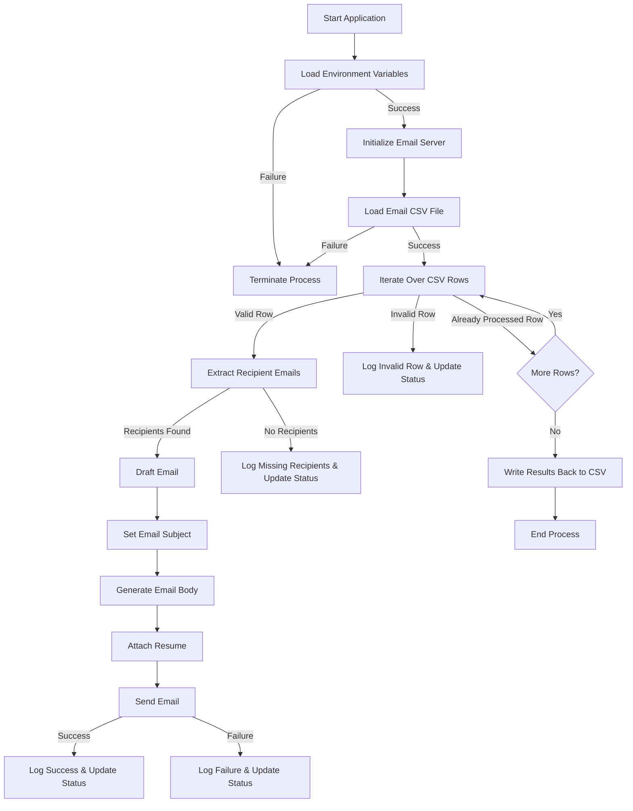

# Mass Email Sender

This Java-based application is for sending emails with an attached resume to multiple recipients across various companies. You can provide a list of emails as a CSV file, and according to the sender's email and the rest of the details you provide an automatic email will be sent to receivers. This program is containerized using Docker for ease of deployment.


A generated email might look like this:

**Subject:** Application for Software Engineering Internship at Google

**Body:**

```text
Dear Sir/Madam,

I hope this message finds you well. My name is Sundar Pichai, and I am currently a third-year undergraduate studying 
Computer Science at the University of Colombo School of Computing. I am writing to express my keen interest in securing a 
Software Engineering internship position at Google.

...

I have attached my resume for your review and am available for an interview at your earliest convenience. Thank
you for considering my application. I look forward to the possibility of joining Google as a Software Engineering
intern and contributing to your team's success.

Best regards,
Buddhika Senanayake.
+94 71 234 5678
example@email.com
https://www.linkedin.com/in/buddhikanip/
```
**Attachment:** resume.pdf


All the above content can be customized according to your own will.

## Project Structure

```bash
.
├── Dockerfile
├── docker-compose.yml
├── pom.xml
└── src
    ├── main
    │   ├── java
    │   │   └── com
    │   │       └── email
    │   │           ├── EmailServer.java
    │   │           ├── Mail.java
    │   │           ├── Main.java
    │   │           └── User.java
    │   └── resources
    │       ├── Emails.csv
    │       ├── cover_letter.txt
    │       └── resume.pdf
    └── test
        └── java
```

## Workflow




## How to Run

### Prerequisites

- Java 17+
- Docker and Docker Compose (Optional)

### Steps

1. **Clone the Repository**

   ```bash
   git clone https://github.com/Buddhikanip/Email-Sender.git
   cd Email-Sender
   ```

2. **Build and Run with Docker**

    - Build and Run Docker image:
      ```bash
      docker-compose up --build
      ```

3. **Run Without Docker**

    - Compile the project:
      ```bash
      mvn clean install
      ```
    - Execute the application:
      ```bash
      java -jar target/<your-jar-file>.jar
      ```

4. **Check Logs**
   Monitor the logs to ensure emails are being sent:

   ```bash
   docker logs <container-id>
   ```


## Key Files

- **[Emails.csv](src/main/resources/Emails.csv)**: Contains the recipient details and sending status.
    
    | Status  | Company | Recipient 1                  | Recipient 2                 | Recipient 3             |
    |---------|---------|------------------------------|-----------------------------|-------------------------|
    | Sent    | Google  | sundar.pichai@gmail.com      | walter.white@gmail.com      | jesse.pinkman@gmail.com |
    | Failed  | Netflix | michael.scofield@netflix.com | lincoln.burrows@netflix.com |
    | Pending | Apple   | steve.jobs@apple.com         |

    - First column: `status`
        - Initially you can keep it empty. The program will append the status of the email to that column. 
    - Second column: `company name`
    - Third column onwards
        - Receiving emails under the specified company. One cell can contain only one email. If there's a second or third email for the same company, you can put them in the 4th column onwards
        
- **[email\_body.txt](src/main/resources/email_body.txt)**: A customizable template as text file containing email body.

  ```text
  Dear Sir/Madam,

  I hope this message finds you well. My name is {name}, and I am currently a third-year undergraduate studying 
  Computer Science at the University of Colombo School of Computing. I am writing to express my keen interest in 
  securing a Software Engineering internship position at {company}.
  ...
  I have attached my resume for your review and am available for an interview at your earliest convenience. Thank
  you for considering my application. I look forward to the possibility of joining {company} as a Software Engineering
  intern and contributing to your team's success.

  Best regards,
  {name}.
  {phone}
  {email}
  {linkedIn}
  ```

- **[resume.pdf](src/main/resources/resume.pdf)**: Your resume file.
- **[resume.pdf](src/main/resources/resume.pdf)**: Sample .env file.
  
```env
# Email server settings
EMAIL_USERNAME=example@gmail.com
EMAIL_PASSWORD=your-email-app-password
EMAIL_HOST=smtp.gmail.com

# Email content
EMAIL_SUBJECT=Application for Software Engineering Internship at {company}
COVER_LETTER=cover_letter.txt

# Personal details for the cover letter
NAME=John Doe
PHONE=+94 71 234 5678
EMAIL=example@email.com
LINKEDIN=https://linkedin.com

# Resume file
RESUME=resume.pdf
```

You can set a .env in the root directory and customize your details.\
`EMAIL_USERNAME`: Your email address (send address)\
`EMAIL_PASSWORD`: 
If you are using Gmail this is a 16-digit passcode that allows a third-party app or device to access your Google Account. (Not your Gmail password)
[For reference](https://knowledge.workspace.google.com/kb/how-to-create-app-passwords-000009237) 

If you are using some other email service your email server access password.

## Customization

how the code can be customized

## Features

- **Dynamic Email Generation**: Personalizes each recipient's email body and subject line.
- **CSV-based Management**: Tracks sending status and recipient details.
- **Resume Attachment**: Automatically attach the specified resume file.
- **Dockerized Deployment**: Simplifies setup and ensures a consistent environment.


## License

This project is licensed under the MIT License.

## Contributions

Feel free to submit issues or pull requests for improvements
